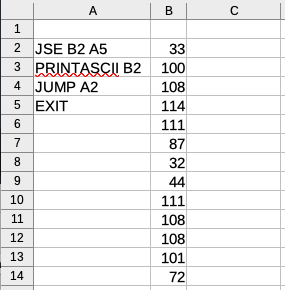
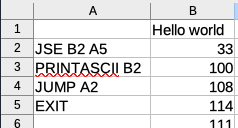
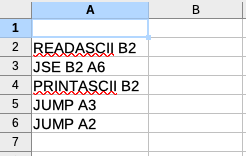

# StackGrid

StackGrid is a fun, new take on assembly language, stacks, and grids.

## Setup

```shell
npm install
node cli.js --file <path>
```

See the [examples directory](./examples/) for example files.

## About

### Cells and stacks

A StackGrid program is laid out on a grid whose cells contain [instructions](#instruction-set) or data. (The file format used for the CLI is CSV, and program are probably best edited using a spreadsheet application.)

The interpreter starts from the top-left-most cell containing an instruction and then reads down the column until it reaches an `EXIT` instruction. (So any number of empty rows and columns may be added before the first instruction. In the "Hello World" program, for example, we see that the first instruction is on the second line.)

The operands of StackGrid instructions are cell addresses (exactly like the ones you would use in a spreadsheet application): rows are numbered from top to bottom starting from "1", while columns are lettered from left to right starting from "A".

For example, the following program prints "Hello World!":



- `JSE B2 A5` jumps to cell `A5` if the stack at `B2` is empty
- `PRINTASCII B2` prints the cell at the top of the stack `B2` (`72` on the first run) as an ASCII value
- `JUMP A2` jumps back to cell `A2`
- `EXIT` exits the program

### Comments

StackGrid has no explicit comment syntax. Any cell that is unreachable and unused by the program can be used for commenting.

For example, in this program, the "Hello world" in cell B2 is ignored:



### Flipping

StackGrid has a special `FLIP` instruction that changes the direction of the instruction pointer. When the program is flipped, instructions (as well as data) are read from left-to-right instead of top-to-bottom.

The following programs both implement a simple `cat` (read from stdin into a stack and write the stack to stdout):




### Instruction Set

- `JUMP [target]`: Jumps to `target`
- `JSE [stack] [target]`: Jumps to `target` if `stack` is empty
- `JEQ [stack1] [stack2] [target]`: Jumps to `target` if the top of `stack1` and `stack2` are equal
- `JNE [stack1] [stack2] [target]`: Jumps to `target` if the top of `stack1` and `stack2` are not equal
- `READASCII [stack]`: Reads from stdin into `stack`
- `PRINTASCII [stack]`: Prints the top of `stack` as ASCII and followed by a space character
- `PRINT [stack]`: Prints the top of `stack`
- `EXIT`: Exits the program
- `POP [stack]`: Pops the top of `stack`
- `CYCLE [stack]`: Cycles `stack`
- `INC [stack]`: Increments the value at the top of `stack`
- `COPY [stack1] [stack2]`: Copies `stack1` into `stack2`
- `FLIP`: Changes the direction of the instruction pointer
- `DUP [stack]`: Duplicates the value at the top of `stack`
- `ADD/SUB/MUL/DIV/MOD/AND/OR/XOR/NAND/NOT [stack1] [stack2]`: Performs the corresponding math operation on `stack1` and `stack2`.

### Theme

StackGrid plays to the theme of LangJam (Assembly) with its assembly-like syntax and cells that work like registers. Watching the interpreter state change as the program runs also feels like watching the program and data get assembled.
